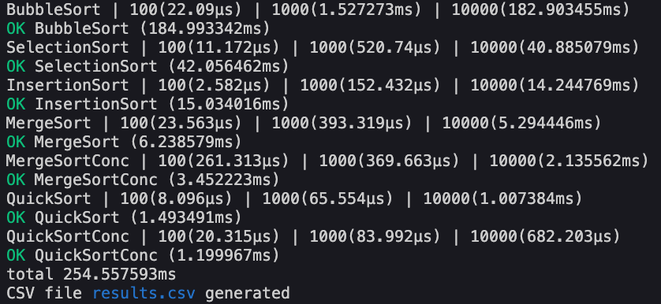
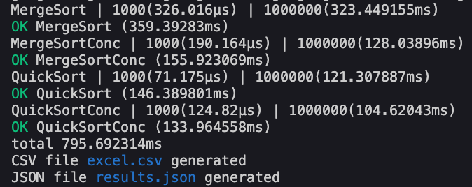

[](https://goreportcard.com/report/github.com/gregoryalbouy/go-sorting-algorithms)
[](https://pkg.go.dev/github.com/gregoryalbouy/go-sorting-algorithms)

# go-sorting-algorithms

I had never realized how fascinating sorting algorithms could be, until I saw [this amazing video](https://www.youtube.com/watch?v=kPRA0W1kECg). It motivated to implement some of them in my favorite language, Go.

I also tried to slightly improve the performance of some of them using concurrency (see [mergesort.go](./sorting/mergesort.go) and [quicksort.go](./sorting/quicksort.go)), since it's so easy and pleasant to work with in Go. It can lead to up to 50% and 25% performance improvment respectively.

Finally, I wrote a CLI that benchmarks them and generates the data in a .csv or .json file.

## Table of contents

- [Table of contents](#table-of-contents)
- [Algorithms](#algorithms)
  * [Implemented](#implemented)
  * [Coming](#coming)
- [CLI](#cli)
  * [Usage](#usage)
  * [Examples](#examples)
    + [Minimal example](#minimal-example)
    + [Full example](#full-example)
    + [I don't have Go installed](#i-dont-have-go-installed)
- [Todo](#todo)

## Algorithms

### Implemented

* Selection Sort
* Insertion Sort
* Bubble Sort
* Merge Sort :heart: / Merge Sort Conc
* Quick Sort / Quick Sort Conc
* Radix Sort
* Go Sort
* Counting Sort

### Coming

* Cocktail Shaker Sort

## CLI

### Usage

The CLI tool can generate some comparative data on demand. It takes three parameters:

| flag | usage | default value |
| ----- | ----- | ----- |
| `-a` | Names of algorithms to be tested(*) | `""` (all) |
| `-s` | Sizes of the arrays to be sorted | `"100 1000 10000"` |
| `-o` | Filename output (.csv or .json) | `"results.csv"` |

Each parameter accepts several values, in that case they must be **quoted** and separated by a space.

(*) Full names list (*not case-sensitive*):
* BubbleSort
* SelectionSort
* InsertionSort
* MergeSort
* MergeSortConc
* QuickSort
* QuickSortConc
* RadixSort
* GoSort
* CountingSort

### Examples

#### Minimal example
```console
go-sorting-algorithms$ go run .
```


#### Full example
```console
go-sorting-algorithms$ go run . -a "MergeSort MergeSortConc QuickSort QuickSortConc" -s "1000 1000000" -o "excel.csv results.json"
```


#### I don't have Go installed

This is a **no-go**. :poop:

Well, in fact the CLI application is cross-platform compiled and accessible without any additionnal installation through the executables in `/bin` directory.

##### Unix systems
```console
path/to/go-sorting-algorithms/bin$ ./gsa -a "MergeSort QuickSort" -s 1000000
```

##### Windows systems
```console
C:\path\to\go-sorting-algorithms\bin>gsa.exe -a "MergeSort QuickSort" -s 1000000
```

Of course you should never run executables you can't 100% trust, so maybe don't do this.

## Todo

* Implement more funky algorithms
* Add output `none`/`cli` (no file generated) as default output value
* Add output `localhost:PORT` to get the json served on local http server